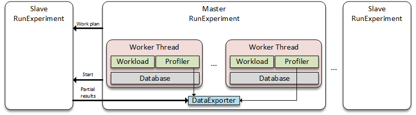
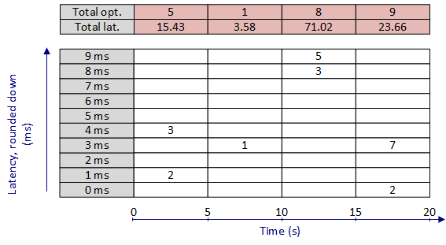

# Multi-Tenant Benchmarking Tool (MTBT)
Multi-tenant Benchmarking Tool (MTBT) is a Java-based key-value store benchmarking tool. As the name suggests, it is multi-tenant (i.e., you can create multiple jobs with different parameters), and workload-dynamic (i.e., you can issue changes to the workload for a particular job throughout the execution). The most important features of MTBT are:

* **Multi-process**: Multiple MTBT processes can co-ordinate to execute a given work plan. One of the processes is designated as the *master*, while the remaining ones are called the *slaves*. Master coordinates the overall execution by sharing the work plan and synchronizing processes, and combines the final result collected by each MTBT process.
* **Multi-tenant**: Multiple jobs can be defined, each having its own parameters (e.g., number of queries per second, query ratios, etc.).
* **Dynamic**: Given a run time for the experiment, you can schedule changes to the throughput (i.e., queries per second) of any job. 
* **Extensible**: In order to benchmark a new database system, you can implement necessary MTBT interfaces and execute core MTBT functionality for your particular test case. 

## Architecture
MTBT works based on what is called a *work plan* configuration that specifies the number of jobs, the common properties (e.g., the host to connect to, the port number), and job-specific properties (e.g., number of threads for the job, read ratio, etc.). You can run multiple MTBT processes and make them execute the same work plan in coordination. MTBT can run in two modes:

1. **Load mode**: As the name suggests, this mode is executed to populate the tested database with the initial data. MTBT processes execute requested number of key-value insert queries for each job.
2. **Run mode**: Once the loading phase is complete, using this mode (the default mode), you can run experiments on your data.

In this section, we'll discuss architectural topics, such as implementation details, execution flow, types of queries supported in MTBT, etc.
 
### Core Classes


The core of MTBT is composed of the following core classes:

* **RunExperiment**: This class is the entry point, or the main class, of MTBT structure. This class acts as the coordinator throughout the execution, by creating threads, handling inter-process communication, combining results. In case multiple MTBT processes run, one of them is designated as the master, while the remaining are slaves. The master process is responsible for getting the work plan (i.e., the file that explains experiment setup) from console and sharing it with the slave processes. Once each process is done, master process combines partial results from each slave process (including itself). 

* **WorkerThread**: This class encapsulates entities of a single thread, and is responsible for organizing each and every one of them. It starts Database, Profiler, and Workload classes. Using the Workload class, it generates a single query, and sends it to the Database class to actually execute the query. Finally, it sends query statistics (e.g., execution time, starting and ending time) to the Profiler class. 
* **Workload**: This interface generates a key-value query (e.g., insert, read, update, delete) based on the given properties (e.g., query ratios, key distribution, value size).
* **Database**: Given a query, this interface is responsible for implementing the business-logic. It is the only class that talks with the benchmarked database management system. 
* **Profiler**: This class is responsible for keeping thread-level statistics of query executions.
* **DataExporter**: Given the final results, this interface exports data in a specific format.  

### Execution Flow
1. RunExperiment class initiates and reads input files (i.e., work plan file, slave data).
2. If multiple MTBT processes are running, master process sends work plan data to slave processes. 
3. Each process creates specified number of WorkerThreads.
4. WorkerThreads are started in each process.
5. Each WorkerThread creates its own Profiler, Database, and Workload instances.
6. For specified experiment run time, in each WorkerThread instance:
  1. Workload instance generates a key-value query and gives it to WorkerThread instance.
  2. WorkerThread records start time of the query execution and gives query to Database instance.
  3. Database instance executes the query based on its business-logic.
  4. WorkerThread records end time of the query execution and gives start-end times to Profiler instance.
  5. Profiler records query statistics.
7. Each MTBT process gathers partial results from its WorkerThreads.
8. If multiple MTBT processes are running, slave processes send partial results to the master. 
9. The master combines results from all processes. Using DataExporter, it writes final results to file(s).

### Design Choices

*Each MTBT process runs the same work plan*: The most critical input to MTBT is the work plan, which specifies experiment parameters (e.g., host name, host port number). One of those parameters is the number of threads for each job. When you run your experiment using multiple MTBT processes (possibly using multiple machines), each process creates given number of threads for each job. For instance, for job-1, you specified in the work plan that the number of threads is 10. Let's say you have 4 MTBT processes that will run your experiment. In such setup, each process will create 10 threads for job-1, summing up to 40 threads for the given job. This multiplication by 4, due to 4 MTBT processes, is done for each job in the given work plan.

*Loading and testing should be done with same number of threads*: Assume for job-1, you'll have 40 threads in total, based on the previous calculation. Prior to benchmarking the system, you may want to populate the database with some initial dataset, say with 1 million key-value pairs. During the thread creation process, RunExperiment class gives unique ids to each thread for job-1, ranging from 1 to 40. Next, 1 million rows are equally partitioned over job-1 threads, so that each thread is responsible for 1M/40=25K key-value pairs. Now, each thread creates 25K key-value pairs as follows:

* For c = 1 to 25000
  * Using some hash function, F, calculate c's hash, c' = F(c)
  * Concatenate c' with unique thread ID to get the key counterpart, key = c' || "-" || ID.
  * Randomly create value according to the job specifications.
  * Store (key, value).
  
As you see, 25K key-value pairs now "belongs" to job-1 thread with a particular ID. Hence, if you test your system with 80 threads after loading data with 40 threads, the added 40 threads will not "have" any initial data. That is why, you should use the same number of threads and MTBT processes while testing your database as in the loading phase.

### Extensibility
MTBT is designed to be easily-extensible to test new and unimplemented database systems. Rather than arranging all threads, scheduling execution, etc., all you have to do is to implement database interactions for your particular test case. Moreover, you are given the opportunity to implement your own class, and change the format of the output with minimal effort. Here, we'll describe how to achieve those in detail.

#### How to Implement Your Database Class
To interact with the benchmarked database system, you should implement the Database interface in MTBT. In particular, the interface com.linkedin.multitenant.db.Database has the following signature:
```java
public interface Database
{
	public enum DatabaseResult
	{
		OK, FAIL
	}
	public DatabaseResult init(Map<String, String> workPlanProperties, Map<String, String> jobProperties) throws Exception;
	public DatabaseResult doInsert(Query q);
	public DatabaseResult doRead(Query q);
	public DatabaseResult doDelete(Query q);
	public DatabaseResult doUpdate(Query q);
	public DatabaseResult close();
}
```
Important remarks about the interface are:

* init and close methods are called by MTBT once during the initialization and finalization phase for each thread. 
* In init method, workPlanProperties is the common properties, given outside the scope a job (will be clear in the next section). On the other hand, jobProperties is the set of properties for the particular job.
* If any operation fails (e.g., initialization fails, or you catch an exception during insert), don't forget to return DatabaseResult.FAIL. 
* Query class holds key and value data. For read and delete methods, only key data is provided. 

In order to implement your Database interface, you should include perf-tool-core jar in your project, and then implement com.linkedin.multitenant.db.Database interface.

#### How to Implement Your DataExporter Class
Before explaining how to implement your DataExporter class, we should mention how statistics about query executions is kept in MTBT. Our initial aim to implement MTBT was to observe the effects of workload changes on a multi-tenant testing environment. To achieve this aim, we had to visualize the changes in performance metrics (i.e., latency and throughput) over time. We decided that a good way to do that with affordable overhead is to divide the experiment running time in to, what we call, *epochs* or time slots. Next, we collect data about events occurring in the same epoch and summarize for each one. To calculate 95th and 99th percentile latency values, we extended each epoch with an histogram of latency, which keeps the number of operations having a particular latency value. 


 
The above figure hopefully makes it easier to understand how performance data is kept. Given the run time of the experiment, length of each epoch (i.e., granularity), and histogram size, performance data is kept in this logic in the Profiler class. In the above figure, granularity is 5 seconds, whereas the maximum latency to keep track of is 9 ms. As can be seen from the figure, the Profiler instance keeps track of the number of operations that have a particular latency value within a given epoch (e.g., 3 operations with 4 ms latency in the first epoch). In addition to the histogram, Profiler also keeps the total execution time, number of successful and unsuccessful operations for each epoch. This way, we can calculate an accurate average latency, as well throughput in that particular epoch. 

Note that, all those book-keeping is done for each query type (i.e., insert, update, read, delete). 

DataExporter interface has the following short signature:
```java
public interface DataExporter
{
	public void export() throws Exception;
	public void init(Map<String, String> workPlanProperties, Map<String, Profiler> prof) throws Exception;
}
```
Some remarks about the interface are:

* init method is called just once by the master MTBT process, after the experiment is finished running. It takes the common properties, which are defined outside the scope of jobs, in the given work plan. The second parameter is the mapping from job names to final results.
* Once initialization succeeds, RunExperiment will call export method of your DataExporter class. You can look into Profiler javadocs to understand how to get data for a particular epoch of a particular query type.

## Defining Work Plan
Work plan file is the most important input to MTBT, since it actually defines your experiment. You can specify job-specific or common *properties* (i.e., key-value format parameters), which can be processed in core MTBT classes, or your extensions to interfaces. Here, we'll first describe the xml schema syntax for the work plan file. Next, we'll give common properties that are used in MTBT core, and additional properties that come with already implemented test cases.

### XML Schema Syntax
Without showing the xml schema definition file (i.e., xsd file), an example work plan file will look like the following:
```xml
<?xml version="1.0" encoding="UTF-8"?>
<workPlan>
	<property name="common_property_1" value="x"/>
	<property name="common_property_n" value="val"/>
	<job>
		<property name="job_property_1" value="val_1"/>
		<property name="job_property_m" value="val_t"/>		
	</job>	
	<job>
		<property name="job_property_1" value="val_2"/>
		<property name="job_property_m" value="val_4"/>		
	</job>
	<job>
		<property name="job_property_1" value="val_3"/>
		<property name="job_property_m" value="val_8"/>	
		<timeline>
			<change at="100" to="4"/>
			<change at="140" to="3"/>
		</timeline>
	</job>
</workPlan>
```

* The root element is workPlan. It takes an initial set of *common properties* that are shared by each job, followed by the job elements, which represents a single confined job. 
* A property is defined as element that has a name and a value. Name attribute defines what this property is for, while value is the particular value for that property. For instance, a common property defined in MTBT core is work.runTime, which specifies the length of the experiment in seconds.
* A job element takes a set of properties that are job specific (i.e., given to threads that will work for that job) and an optional timeline element, which specifies changes to the throughput for that particular job. 
* A timeline element consists of a set of change elements, which have two attributes: at and to. For instance, in the above example, for the first change in the third job, you can read the changes as: "At 100th second, change throughput to 4 queries per second".

Based on the current implementation of MTBT core and supported test suites, there are a few tens of properties. Some properties are required, such that if you don't have it in your work plan, MTBT will throw an exception. In the following sections, we'll describe the existing properties, and state whether they are required/optional and common/job-specific. 

Note that, when you implement your own Database and/or DataExporter interfaces, you can define additional properties and process them in your class implementations.

### Core Properties
The following properties are provided in perf-tool-core project. Assuming that you don't change the core, most of them will be processed in the background, prior to handing the execution to your Database or DataExporter classes. Required properties are listed as: 

* **work.host**: required/common. Host address of the entry point to the testing environment.
* **work.port**: required/common. Port number for the host's entry point.
* **work.runTime**: required/common. Length of the experiment in seconds. If MTBT runs in loading mode (i.e., you are populating data before the experiment), you don't have to specify this property.
* **job.name**: required/job. Unique name for the job. 
* **job.rowCount**: required/job. Number of rows in the database. If MTBT runs in loading mode, this property specifies the number of key-value pairs to insert. If MTBT runs in run mode (i.e., executing the actual experiment), this property is the number of key-value pairs that are assumed to be inserted to the database.
* **job.threads**: required/job. Number of threads for a job. Each MTBT process creates given number of threads for the job.
* **job.targetThr**: required/job. Number of queries per second per thread for a job. Each thread for that job tries executing given number of queries per second. A thread that achieves this number throttles.
* **job.valueSize**: required/job. Size of the value counterpart in bytes. 

Following properties are optional:

* **work.gran**: optional/common. Length of an epoch in seconds. Default is 10.
* **work.histogramSize**: optional/common. Maximum latency value to keep track of in milliseconds. Default is 100.
* **work.status.period**: optional/common. Frequency of reporting temporary results to the console in seconds. Default is 10.
* **work.exporterClass**: optional/common. Name of the class that implements DataExporter interface. Possible values are:
  * *com.linkedin.multitenant.exporter.ConsoleExporter*: Prints results to the console. This is the default value.
  * *com.linkedin.multitenant.exporter.FileExporter*: Prints results to separate or combined file(s). 
  * *com.linkedin.multitenant.exporter.GoogleVisualizerExporter*: Prints results to an html file, using Google Visualization API.
  * *Your class*: Name of your class that implements DataExporter interface. 
* **work.databaseClass**: optional/common. Name of the class that implements Database interface. Possible values are:
  * *com.linkedin.multitenant.db.DiscardDatabase*: Discards each query. This is the default value.
  * *com.linkedin.multitenant.db.MysqlDatabase*: The class that implements MySQL logic.
  * *Your class*: Name of your class that implements Database interface.
* **job.insertRate**: optional/job. Rate of insert queries. Default is 0.
* **job.readRate**: optional/job. Rate of read queries. Default is 0.
* **job.deleteRate**: optional/job. Rate of delete queries. Default is 0.
* **job.updateRate**: optional/job. Rate of update queries. Default is 0.
* **job.queryDist**: optional/job. Distribution for the key counterpart. Possible values are uniform, zipfian, latest, and hotspot. The default value is uniform.
* **job.queryDist.hotSpot.setFrac**: optional/job. If query distribution is hotspot, this property is the ratio of hot set in the dataset. Default is 0.3.
* **job.queryDist.hotSpot.optFrac**: optional/job. If query distribution is hotspot, this property is the ratio of queries that are executed on the hot set. Default is 0.3.
* **job.valueSize.dist**: optional/job. Distribution for the value size. Possible values are constant, uniform, and zipfian. The default value is constant. 
* **job.valueSize.min**: optional/job. If distribution for value size is not constant, this value specifies the minimum length for the value size in bytes. Default is 1. 

If DataExporter is chosen as GoogleVisualizerExporter, you can specify the path to output with the following property:

* **googleExporter.output**: optional/common. Path to the output. Default is results.html.

If DataExporter is chosen as FileExporter, you can use the following properties in work plan:

* **fileExporter.isCombined**: optional/common. Boolean property that defines if results for each should be combined to a single file. Default is 1. 
* **fileExporter.singlePath**: optional/common. If results will be combined, this property specifies the path to the output file. Default is "results.txt".
* **fileExporter.folderPath**: optional/common. If results will not be combined, this property specifies the folder path to output. Default is ".".

### MySQL Properties
Perf-tool-mysql is the jar file that includes MySQL properties for MTBT. The following properties are defined in this file:

* **mysql.userName**: required/common. User name for MySQL. 
* **mysql.userPass**: required/common. Password of the given user for MySQL.
* **mysql.dbName**: required/job. MySQL database name for the given job.
* **mysql.tableName**: required/job. Table name for the given job.
* **mysql.keyCol**: required/job. Name of the key column.
* **mysql.valCol**: required/job. Name of the value column.
* **mysql.timeout**: optional/job. Request time out in seconds. Default is 0, meaning no time out will occur.

Prior to benchmarking, create the MySQL databases. You don't have to create the tables. 

## How to Build MTBT
The first thing you should do is, of course, download the latest version of the code from Git. Assuming that the root folder of the MTBT source is MTBT_HOME, you may want to edit MTBT logging options before building and running MTBT. MTBT uses [Apache log4j 1.2](http://logging.apache.org/log4j/1.2/) as the logging mechanism. You can edit the log properties file based on your needs.
```bash
cd <MTBT_HOME>
<YOUR_TEXT_EDITOR> perf-tool-core/src/main/java/log4j.properties
```

Once you are done editing log file, you can build MTBT as follows:
```bash
cd <MTBT_HOME>
gradle build
```

After running *gradle build* command, gradle will put each project's final jar file under project_name/build/libs/project_name.jar path. Unless you want to collect dependencies of the jar files by yourself, you can issue the following command:
```bash
cd <MTBT_HOME>
gradle copyLibs
```

Once the command is executed, all dependencies of a project are placed under project_name/otherLibs folder. 

## How to Run MTBT
Before giving sample codes, we briefly describe the necessary files that are used by an MTBT process. Next, we describe the flags, the run time parameters of MTBT. Finally, we show some sample codes to familiarize you on running MTBT.

### Necessary Files
#### Slave Data File
If you will use multiple machines to benchmark your database management system with MTBT, you should provide information about slave MTBT processes to the master MTBT process. In order to do so, you should create a text file, in which each line corresponds to a different MTBT slave process. The format of each line is hostname:port. A sample slave data file would look like this:
```
127.0.0.2:13000
127.0.0.3:13001
127.0.0.4:13002
```

Note that, you need this file only **if you will have multiple MTBT processes in your experiment**. This file should be given only to the master MTBT process. You don't have to create it in slave processes. 

#### Work Plan
Work plan is the file that contains details and parameters of the experiment. As previously mentioned, it is an XML file with a particular syntax. In case you fail to adhere to the syntax rules, MTBT will throw an exception and halt the process. Depending on the system you want to test, you should create the required properties, along with some optional properties if needed. 

Remember that you can always create your own implementations and add your own properties to be used in your classes.

### Flags
Using the flags, i.e., run time options, you can specify the input files, running mode, and waiting time. MTBT has the following flags:

* **-plan=PATH**: Required. Path to the work plan file. 
* **-slaveData=PATH**: Path to the slave data file. Only the master process should specify this flag, in case you'll use multiple processes to execute your experiment.
* **-load**: If stated, MTBT runs in Load mode, in which the database is populated with initial key-value pairs.
* **-slave=PORT**:  Port number to listen to the master MTBT. This flag should be used, while starting a slave MTBT process. For slave processes, it is enough to provide this flag only. 
* **-wait=TIME**: Before creating threads and starting execution, this parameter specifies the number of seconds that should be waited. 

### Sample Scripts
You should first build MTBT as described above. Let EXEC_DIR be the root directory, where you'll copy jars, create necessary files, and run MTBT. In case you'll use already implemented test suites in MTBT project, you can do the following to setup dependencies:
```bash
cd <EXEC_DIR>
mkdir lib
cp <MTBT_HOME>/<project_name>/build/libs/<project_name>.jar lib
cp <MTBT_HOME>/<project_name>/otherLibs/* lib
```

Or, if you wrote your own Database/DataExporter class and want to use it, you can do the following to setup your execution folder:
```bash
cd <EXEC_DIR>
mkdir lib
cp <MTBT_HOME>/perf-tool-core/build/libs/perf-tool-core.jar lib
cp <MTBT_HOME>/perf-tool-core/otherLibs/* lib
cp <YOUR_CLASS_JAR> lib
```

If you'll run multiple MTBT processes, you should repeat above steps for each machine. 

Next, in case of multiple MTBT processes, you should start slave MTBT processes:
```bash
cd <EXEC_DIR>
java -cp "lib/*" com.linkedin.multitenant.main.RunExperiment -slave=<PORT>
```

Next, you should prepare the work plan file for the master MTBT process, and slave data file in case of multiple MTBT processes execution. Once you prepare those files, you can start master MTBT process. A common approach to benchmarking is to, first, populate your database with some initial dataset. In order to do that, you can do the following:
```bash
java -cp "lib/*" com.linkedin.multitenant.main.RunExperiment -plan=<PATH> -slaveData=<PATH> -load
```

If you will run only one MTBT process, then you can omit -slaveData flag. 

Once MTBT is done loading data, all MTBT processes, including slaves, will stop. Hence, to initiate another loading session or running an actual experiment, you should restart all slaves as described previously. 

Finally, you can run your experiment as:
```bash
java -cp "lib/*" com.linkedin.multitenant.main.RunExperiment -plan=<PATH> -slaveData=<PATH>
```

Once again, you can omit -slaveData flag if you'll use only one MTBT process. 
